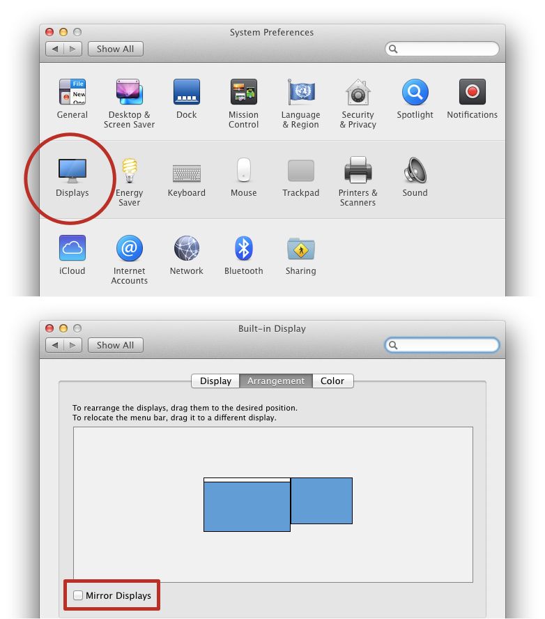
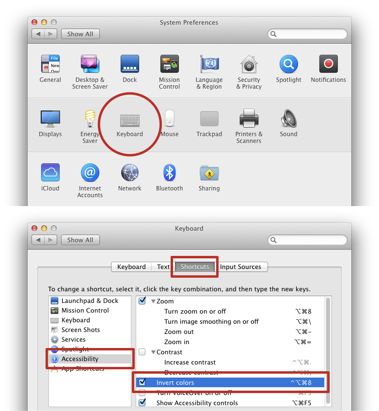
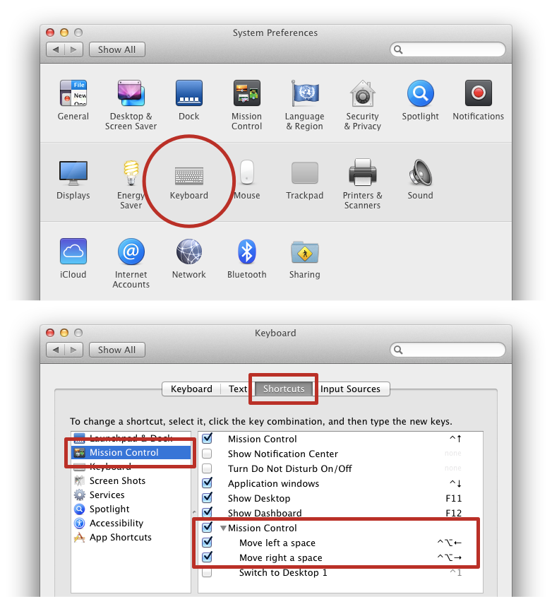
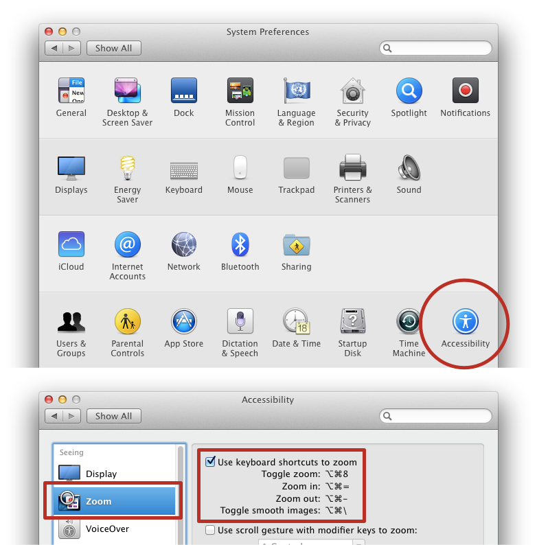

# 10 Tips for Presenting Slides on Mac

> _[François Briatte](mailto:f.briatte@gmail.com)_  
> _\today_

This document is part of the ["Computing Advice for Students"][computing] series.

[computing]: https://github.com/briatte/computing

This document says nothing about the software that you should be using to produce your slides. I will assume that you are using something like [Google Slides][google-slides], [LibreOffice Impress][libreoffice] or [Microsoft PowerPoint][microsoft-ppt]. __Do not use Prezi__ or other software that produces slides that cannot be exported to PDF (Tip #2).

[google-slides]: https://docs.google.com/
[libreoffice]: https://en.wikipedia.org/wiki/LibreOffice
[microsoft-ppt]: https://en.wikipedia.org/wiki/Microsoft_PowerPoint

___All software recommendations below are for Mac and have been tested on OS X 10.9 only.___ Other systems will have different functionalities and use different keyboard shortcuts, and more recent versions of macOS might support better software available than that recommended below.

## 1. Learn to write slides

Several people have contributed [good advice][healy] for making slides: follow it, or become part of the [(serious) problem][tufte] that [bad slides][nyt] create for audiences.

Be aware that your audience will _never_ be able to understand:

- __Unreadable text__ -- i.e. text that is printed in such as a way that it cannot be read. Yellow text on white background is your best way of signalling that you do _not_ want to be read.
- __Information overload__ -- i.e. over 50 words or so per slide. Remove all text that can be, starting with most [articles][articles]. Write as if you were writing [newspaper headlines][headlinese].
- __Pure redundancy__ -- i.e. you reading your slides. This strategy tells your audience that you are trading their time (listening to you) with your inability to handle your pre-talk anxiety.
- __Superfluous decorum__ -- i.e. stock photography, 'clipart' illustrations and fancy 'animated transitions' with exactly zero value-added (unless perhaps when addressing children).

[healy]: https://kieranhealy.org/blog/archives/2018/03/24/making-slides/
[tufte]: https://www.edwardtufte.com/tufte/books_pp
[nyt]: https://www.nytimes.com/2010/04/27/world/27powerpoint.html
[articles]: https://en.wikipedia.org/wiki/Article_(grammar)
[headlinese]: https://en.wikipedia.org/wiki/Headlinese

## 2. Use PDF slides

File formats like the Microsoft PowerPoint (PPT) format are _not_ portable — if you open a PPT file on a different system, your text, tables and figures might show up _very_ differently than they do on your own laptop.

[Adobe PDF][pdf] is the safest way to open your slides on a different system, especially on classroom computers that might not be equipped with Microsoft PowerPoint and the like.

___Note___ – Using PDF slides will also drastically reduce the risk that you use any form of 'animated transitions' and other useless gadgets in your slides, which is a good thing (see previous tip).

[pdf]: https://en.wikipedia.org/wiki/Portable_Document_Format

## 3. Clean up before going public

Before connecting your laptop to a video-projector:

- Move your __Desktop files__ into folders.
- Close personal or unnecessary __browser windows and tabs__.
- Close personal or unnecessary __programs__.
- Make sure that your __desktop picture__ will not be a distraction.

Similarly, if you are going to plug a __USB disk__ into a laptop that is connected to a video-projector, move personal files at the top level of the disk into folders.

Last, do not have any (email, low battery, social media…) notifications bother you during your presentation. The best way to achieve that is not to use any notifications in the first place.

___Related___ – Useful keyboard shortcuts to clean up your screen:

- Hide all windows except the current one: __Cmd-Alt-H__
- _Close_ all windows: __Cmd-Alt-W__

## 4. Prevent your screen from dimming

If the computer showing your slides is not connected to a power source, it might 'go to sleep' during your presentation: use Caffeine ([Mac][caffeine-mac], [Win][caffeine-win], [Linux][caffeine-linux]) to stop the screen from dimming.

[caffeine-mac]: http://lightheadsw.com/caffeine/
[caffeine-win]: http://www.zhornsoftware.co.uk/caffeine/index.html
[caffeine-linux]: https://github.com/kzar/caffeine

## 5. Mirror your screen

The __'Displays'__ panel in your System Preferences allows you to mirror your screen, i.e. the built-in display of your laptop, to an external screen, such as a class video-projector.

___See Appendix A___ at the end of this document for annotated screenshots.

___Note___ – This trick will solve cases where the video-projector is not automatically mirroring your display (i.e. showing a copy of your screen), but it will _not_ solve channel issues: make sure to select the right A/V input source on your video-projector.

## 6. Know about colour inversion

The __'Keyboard'__ panel in your System Preferences allows you to use a keyboard shortcut to invert the colours of your screen. The default keyboard shortcut for this action is __Cmd-Alt-Ctrl-8__.

This trick, which takes advantage of an [accessibility feature][ux], can help viewing bright (black on white) slides in a very bright environment such as a excessively sunny classroom with no shades.

___See Appendix B___ at the end of this document for annotated screenshots.

[ux]: https://ux.stackexchange.com/a/26332

## 7. Use full-screen keyboard shortcuts

To get into full-screen 'slideshow' mode, press:

- In Acrobat Reader: __Cmd-L__
- In Apple Preview: __Cmd-Shift-F__
- In PowerPoint: __Cmd-Enter__

On Macs, full-screen windows are shown on different __'Spaces'__ that will open to the right of the current one. To move between Spaces, learn the keyboard shortcuts attached to this action from the __'Keyboard'__ panel of your System Preferences.

___See Appendix C___ at the end of this document for annotated screenshots.

___Note___ – Some software like Microsoft PowerPoint will handle presentations through some kind of 'diaporama' mode that will make your computer screen and your video-projector screen show different content. To avoid that, and to avoid other portability issues, just __always use PDF slides__ (Tip #2).

## 8. Learn to zoom in and out

The __'Accessibility'__ panel in your System Preferences allows you to use keyboard shortcuts to zoom in or out of a specific region of your screen: __Cmd-Alt-8__, for instance, will toggle the zoom.

This trick, which is meant to help users with impaired vision, can help enlarging small text or specific parts of a figure or table.

___See Appendix D___ at the end of this document for annotated screenshots.

## 9. Learn to switch between applications and cycle through windows

In order to move swiftly from your slides to other parts of your system during your presentation (e.g. to show another file):

- Switch between applications with __Cmd-Tab__.
- Cycle through the windows of an application with __Cmd-``` ` ```__.

On Windows, the combination of both actions above is provided by the __Alt-Tab__ keyboard shortcut, which cycles through all windows (of all applications) when pressed.

___Note___ – Macs also have something called [Mission Control][mission-control] that offer different ways to move between applications and windows, which I tend to find confusing, but try it and make your own mind.

[mission-control]: https://en.wikipedia.org/wiki/Mission_Control_(macOS)

___Related___ – If your presentation involves showing multiple windows side-by-side, use software like [Spectacle][spectacle] to manage the location of your windows on screen. Using Spectacle is also useful to maximise windows, since on recent Macs, the (green) window maximisation item of your windows will produce full-screen windows instead of maximised window. Spectacle is mentioned in Tip #2 of ["10 Additional Computing Tips and Tricks for Students"][ct2-pdf].

[ct2-pdf]: https://cdn.rawgit.com/briatte/computing/85f32dec/computing-tricks-2.pdf

[spectacle]: https://www.spectacleapp.com/

## 10. Use large text display

If you do not have access to a board on which to write any information that is not in your slides, software like [Alfred][alfred] will be helpful to show large text to your audience.

Tip #3 of ["10 Computing Tips and Tricks for Students"][ct1-pdf] will tell you about 'launcher' programs like Alfred, which also vastly improve searching for disk files or looking for information online.

[alfred]: https://www.alfredapp.com/
[ct1-pdf]: https://cdn.rawgit.com/briatte/computing/85f32dec/computing-tricks-1.pdf

\newpage\appendix

## Appendix A. 'Mirror Displays' option (Tip #5)

<!-- NOTE: \vspace{-2em} will help image fit on page -->

\vspace{-2em}

\clearpage

## Appendix B. 'Invert Colors' option (Tip #6)

\vspace{-2em}

\clearpage

## Appendix C. Spaces-related keyboard shortcuts (Tip #7)

\vspace{-2em}

\clearpage

## Appendix D. Zooming in and out of the screen (Tip #8)

\vspace{-2em}

\clearpage
